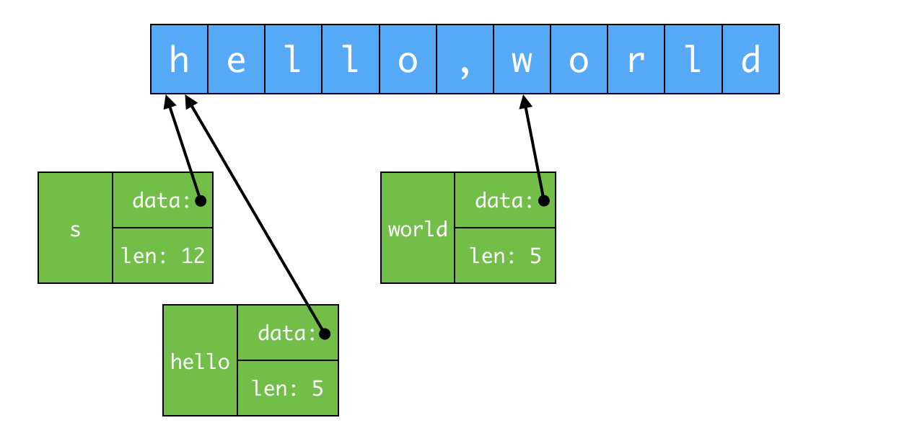

> 字符串是不可变的字节序列, 它可以包含任意数据, 包括 0 值字节, 但主要是人类可读的文本, 习惯上文本字符串被解读成按 `UTF-8` 编码的 `Unicode` 序列.

内置的 `len()` 函数返回字符串的字节数(并非文字符号的数目), 下标访问操作 `s[i]` 则取到的第 i 个字符, 其中 `0 ≤ i < len(s)`

```go
s := "hello, world"
fmt.Println(len(s))         // 12
fmt.Println(s[0], s[7])     // 104 119
```

字符串可以通过比较运算符作比较, 如 `==` 和 `<`, 比较运算按字节生成, 结果服从本身的字典排序

```go
s1 := "abc"
s2 := "acc"
fmt.Println(s1 == s2)   // false
fmt.Println(s1 < s2)    // true
```

尽管可以将新值赋予字符串, 但字符串的值本身无法改变: 字符串值本身所包含的字节序列用不可变, 不可变意味着两个字符串能够安全的共用同一段底层内存, 使得复制任何长度字符串的开销都很低, 类似的, 字符串 `s` 和其子串 `s[7:]` 可以安全地共用数据, 因此子串生成操作的开销很低廉, 这两种情况下都没有分配新内存.

```go
s := "hello, world"
hello := s[:5]
world := s[7:]
```



在字符串的复制和截取操作中, 底层字节数组是不变的, 真正变化的只有指向字节数组的索引(字面量)

# 1. 字面量
> 字符串的值可以直接写成字符串字面量(string literal), 形式上就是带上双引号的字节序列.

因为 Go 源代码总是按照 `UTF-8` 的形式编码, 并且习惯上 Go 的字符串可以按照 UTF-8 解读, 所以在源代码中可以将 `Unicode` 写入字符串字面量.

原生字符串字面量的书写形式是 \`...\`, 使用反引号而不是双引号, 原生的字符串字面量内, 转移序列不起作用, 实质内容与字面写法严格一直, 包括反斜杠和换行符, 因此, 在程序的源代码中, 原生字符串可以展开多行, 唯一的特殊处理是回车符 `\n` 会被删除, 使得同一字符串在所有平台上的值都相同.

```go
const GoUsage = `Go is a tool for managing Go source Code.
Usage:\n
	gp command [arguments]\t\n\\
...`
```

# 2. Unicode

> Unicode 囊括了世界上所有文书系统的全部字符, Go 语言中 `rune` 类型作为 `int32` 类型的别名, 用于保存 Unicode

# 3. UTF-8

> UTF-8 以字节为单位对 Unicode 做变长编码, UTF-8 是现行的一种 Unicode 标准, 每个文字符号由 1~4 个字节表示, `ASCII` 字符的编码仅占 1 个字节, 而其他常用的文书字符的编码只是 2 ~ 3 个字节.
一个文字符号编码的首字节高位指明了后面还有多少字节, 这样就与传统的 `ASCII` 码一致, 若最高位为 0, 则标示着它是 7 位的 `ASCII` 码, 其文字符号的编码仅占 1 字节, 若最高位是 110, 则文字符号的编码占用 2 个字节, 第二个字节以 `10` 开始.

```
0xxxxxxx                            文字符号 0 ~ 127
110xxxxx 10xxxxxx                   128 ~ 2047
1110xxxx 10xxxxxx 10xxxxxx          2048 ~ 65535
11110xxx 10xxxxxx 10xxxxxx 10xxxxxx 65536 ~ 0x10ffff
```

Go 源代码总是以 `UTF-8` 编码, 同时需要用 Go 程序操作的文本字符串也优先采用 `UTF-8` 编码.


```go
func main() {
    s := "Hello, 世界"
    fmt.Println(len(s))						// 13
    fmt.Println(utf8.RuneCountInString(s))	// 9

    /*
    0   H
    1   e
    2   l
    3   l
    4   o
    5   ,

    7   世
    10  界
     */
    for i := 0; i < len(s); {
        // DecodeRuneInString 返回一个 r(文字符号本身) 和 一个值(表示 r 按 UTF-8 编码所占用的字节数)
        r, size := utf8.DecodeRuneInString(s[i:])
        fmt.Printf("%d\t%c\n", i, r)
        i += size                           // 用当前文字符号的 UTF-8 编码所占用的字节数更新下标
    }
}
```

# 4. 字符串和字节 slice
以下 4 个标准包对字符串操作特别重要:

| 包名 | 作用 |
| --- | --- |
| bytes | bytes 包也有类似的功能, 用于操作字节 slice, 由于字符串不可变, 因此按增量方式构建字符串会导致多次分配和复制, 这种情况下使用 `bytes.Buffer` 类型会更高效 |
| strings | 提供许多函数, 用于搜索, 替换, 比较, 修整, 切分和连接字符串 |
| strconv | 主要用于转换布尔值, 整数, 浮点数为与之对应的字符串形式, 或者把字符串转换成其他类型, 另外还有为字符串添加 / 去除引号的函数 |
| unicode | 用于判别文字符号值特性, 如 IsDigit, IsLetter, IsUpper 和 IsLower, 每个函数以单个文字符号作为参数, 并返回布尔值 |

```go
// 用于展示文件本身的名字, 出去路径名和后缀
// e.g., a/b/c.go => c

import "strings"

func basename(s string) string {
    // 保留最后一个 / 之后的全部内容
    for i := len(s) - 1; i >= 0; i-- {
        if s[i] == '/' {
            s = s[i+1:]
            break
        }
    }

    // 保留最后一个 . 之前的全部内容
    for i := len(s) - 1; i >= 0; i-- {
        if s[i] == '.' {
            s = s[:i]
            break
        }
    }
    return s
}

func basename1(s string) string {
    // 取最后一个子串, 如果没取到, 返回 -1
    i := strings.LastIndex(s, "/")
    s = s[i+1:]
    if dot := strings.LastIndex(s, "."); dot != -1 {
        s = s[:dot]
    }
    return s
}
```


```go
s := "abc"
b := []byte(s)
s2 := string(b)
```

> 字符串和字节 slice 可以相互转化, 概念上, `[]byte(s)` 转换操作会分配新的字节数组, 拷贝填入 s 含有的字节, 并生成一个 slice 引用, 指向整个数组.
反之, 用 `string(b)` 将字节 slice 转换成字符串也会产生一份副本, 保证 s2 也不可变


bytes 包为高效处理字节 slice 提供了 `Buffer` 类型, Buffer 起初为空, 其大小随着各种类型数据的写入而增长, 如 string, byte 和 []byte, Buffer 无需初始化, 原因是零值本来就有效.

[printints](https://github.com/DestinyWang/gogl.io/blob/master/ch3/5_string/examples/printints.go)

