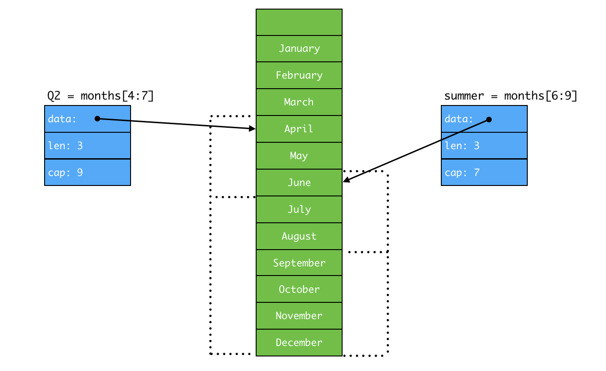

> Slice 表示一个相同类型元素的可变长序列, Slice 通常写成 `[]T`, 其中元素的类型都死 T, 看起来像不限制长度的数组.
slice 和数组是紧密关联的, slice 是一种轻量级的数据结构, 可以用来访问数组的部分或者全部元素, 而这个数组成为 slice 的 `底层数组`, slice 有三个元素: 指针, 长度和容量.

| 属性 | 含义 |
| --- | --- |
| 指针 | 指向数组的第一个可以从 slice 访问的元素, 总金额和元素不一定是数组的第一个元素 |
| 长度 | slice 的长度, 不能超过 slice 的容量 |
| 容量 | 通常是 slice 的起始䛾到底层数组的最后一个元素间元素的个数. |

Go 的内置函数 `len` 和 `cap` 用来返回 slice 的长度和容量.

一个底层数组可以对应多个 slice, 这些 slice 可以引用数组的任何位置, 彼此间的元素也可以重叠.

```go
// January 是 months[1], December 是 months[12]
months := [...]string{1: "January", /*...*/, 12: "December"}
```



如果 slice 的引用超过了被引用对象的容量, 即 `cap(s)`, 那么会导致程序报错;
而如果 slice 的引用超过了被引用对象的长度, 即 `len(s)`, 那么最终 slice 会比原 slice 长.

```go
fmt.Println(summer[:20])    // 报错, 超过了被引用数组的边界
endlessSummer := summer[:5] // 在 slice 容量范围内扩展了 slice
fmt.Println(endlessSummer)  // "[June July August October November]"
```

内置函数 `make` 可以创建一个具有指定元素类型, 长度和容量的 slice, 其中容量可以省略, 默认和长度相等.

```go
make([]T, len)
make([]T, len, cap)
```

> make 创建了一个无名数组并返回了它的一个 slice, 这个数组尽可以通过 slice 来访问.

# 1. append 函数

> 内置函数 append 用来将元素追加到 slice 后面

```go
var runes []rune
for _, r := rang "Hello, 世界" {
    runes = append(runes, r)
}
fmt.Println("%q\n", runes)  // "['H', 'e', 'e', 'l', 'o', ',', ' ', '世', '界']"
```

虽然最方便的用法是 []rune("Hello, 世界"), 但是上面的循环演示了如何使用 append 来为一个 rune 类型的 slice 添加元素